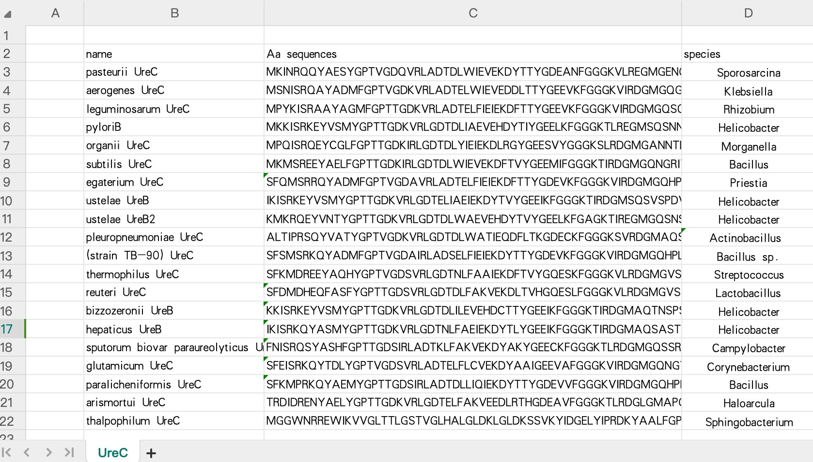

### 序列相似性分析工具

#### **功能概述**

该代码用于自动化分析蛋白质/核苷酸序列的相似性，核心功能包括：

1. **数据预处理**：清洗Excel表格中的蛋白质/核苷酸序列数据
2. **BLAST比对**：执行全基因组两两序列比对
3. **相似度矩阵构建**：解析BLAST结果生成相似度矩阵
4. **热图可视化**：生成专业级序列相似性热力图

#### 输入文件格式要求

输入文件必须是Excel格式（`.xlsx`），格式如下：



> ⚠️ 注意：name和species列的内容最后面不要有空格（如`pasteurii UreC 空格` → `pasteurii UreC`）
>
> ⚠️ 注意：物种名称需去除括号内容（如`Ectocarpus siliculosus（褐藻）` → `Ectocarpus siliculosus`）
> 
> ⚠️ 注意：如果是核苷酸序列，不需要更改列名Aa sequences，直接放核苷酸序列即可

#### 安装流程

```bash
# 创建Conda虚拟环境
conda create -n SeqSimHM python=3.9
conda activate SeqSimHM

# 安装Jupyter核心组件
conda install jupyter
conda install ipykernel

# 将虚拟环境注册为Jupyter内核
python -m ipykernel install --user --name=SeqSimHM --display-name "SeqSimHM"

# 安装依赖
conda install numpy pandas matplotlib

# 启动Jupyter并切换内核
jupyter notebook
	1.在浏览器打开的Jupyter界面中：
	2.新建Notebook → 右上角Kernel菜单
	3.选择对应的内核

# 删除内核
jupyter kernelspec uninstall SeqSimHM
```

#### 核心参数说明

在`main()`函数中需配置四个关键参数：

|     参数     |  类型  |           描述           |         示例值          |
| :----------: | :----: | :----------------------: | :---------------------: |
| `file_path`  | String |      excel文件路径       |   "./data/UreC.xlsx"    |
|   `sheet`    | String |   excel中要分析的sheet   |         "UreC"          |
| `input_json` | String |  预处理后的JSON文件路径  | "./cleanData/UreC.json" |
| `output_dir` | String | 结果输出目录（自动创建） |    "./analysis/UreC"    |

#### *使用示例

```python
# 从Excel到全流程分析
file_path = "./data/UreC.xlsx"
sheet = "UreC"
input_json = "./cleanData/UreC.json"
output_dir = "./analysis/UreC"
main(file_path, sheet, input_json, output_dir)
```
